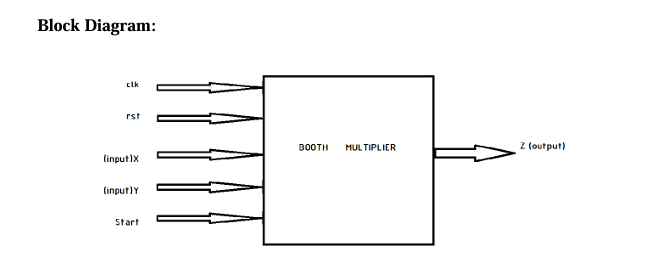
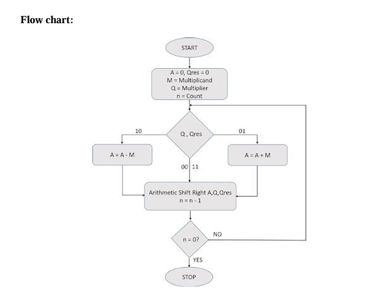
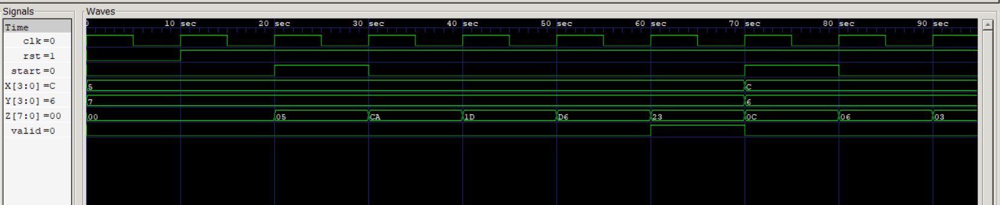

## Booth Algorithm Verilog
This repository contains an implementation of the Booth Multiplier, a binary multiplication algorithm that efficiently handles both positive and negative integers. The design is implemented in Verilog and supports 4-bit inputs, producing an 8-bit product. The project includes a testbench for verification and simulation, demonstrating the functionality of the Booth algorithm.

# Algorithm
**Step 1:** Load the initial values for the registers.  
A = 0 (Accumulator), Qres = 0, M = Multiplicand, Q = Multiplier and n is the count value which 
equals the number of bits of multiplier. 
 
**Step 2:** Check the value of {Q0,Qres}. If 00 or 11, go to step 5. If 01, go to step 3. If 10, go to 
step 4. 
 
**Step 3:** Perform A = A + M. Goto step 5.      
   
**Step 4:** Perform A = A - M. 
 
**Step 5:** Perform Arithmetic Shift Right of {A, Q, Qres} and decrement count.  
 
**Step 6:** Check if counter value n is zero. If yes, go to next step. Else, go to step 2. 
 
**Step 7:** Stop 

# Block Diagram

# Flowchart

# Simulation Result

